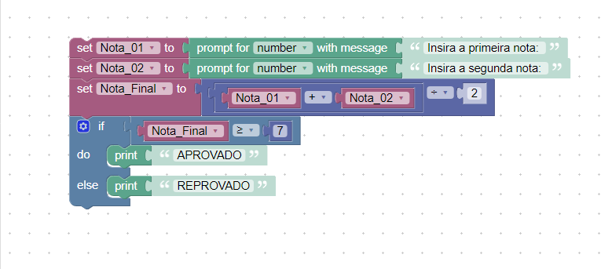
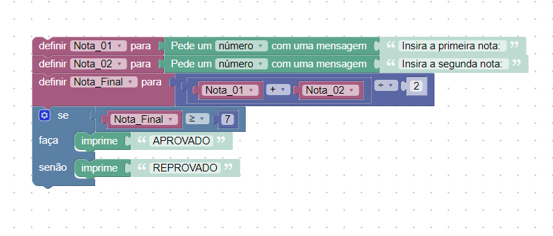

## Instruções

No hipertexto anterior, temos um exemplo de um fluxograma que realiza o cálculo da média de duas notas de um aluno. O fluxograma solicita duas notas que serão somadas, e logo em seguida a média dessas notas é calculada. Dessa forma o resultado da média quando é maior ou igual a 7 o aluno está APROVADO, quando menor que 7 o aluno está REPROVADO.

Utilizando o Google Blockly construa o algoritmos que realiza esse processamento.

# Resolução
## Algoritmo em inglês

## Algoritmo em português brasileiro


- link de acesso: https://blockly-demo.appspot.com/static/demos/code/index.html?lang=pt-br#di5ygw


## Código em javascript:
```javascript
var Nota_01, Nota_02, Nota_Final;


Nota_01 = Number(window.prompt('Insira a primeira nota: '));
Nota_02 = Number(window.prompt('Insira a segunda nota: '));
Nota_Final = (Nota_01 + Nota_02) / 2;
if (Nota_Final >= 7) {
  window.alert('APROVADO');
} else {
  window.alert('REPROVADO');
}
```
