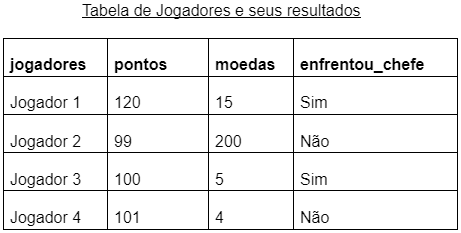

## Instruções

Na tabela em anexo, encontramos dados de 4 jogadores de um game que contemplam os pontos e moedas obtidos durante as partidas e se conseguiram lutar ou não com o chefe.

Baseado nos dados desses jogadores, foram construídas algumas expressões. Avalie cada expressão abaixo, observando as condições de cada jogador, descrito na tabela acima. Marque com V( Verdadeiro) ou F(Falso) o resultado de cada expressão.

Dica: Lembre-se de substituir as variáveis "pontos", "moedas" e "enfrentou_chefe" pelos valores correspondentes para cada jogador.

Expressões:
+ (   ) Jogador 1: (pontos >= 100) and (moedas >= 5) and (enfrentou_chefe == Sim)
+ (   ) Jogador 2: (pontos >= 100) and (moedas >= 5) and (enfrentou_chefe == Não)
+ (   ) Jogador 3: (pontos < 100) or (moedas < 5) or (enfrentou_chefe == Sim)
+ (   ) Jogador 4: (pontos != 100) or (moedas != 5) or not(enfrentou_chefe == Não)

  

## Resolução

+ ( V ) Jogador 1: (pontos >= 100) and (moedas >= 5) and (enfrentou_chefe == Sim)
+ ( F ) Jogador 2: (pontos >= 100) and (moedas >= 5) and (enfrentou_chefe == Não)
+ ( V ) Jogador 3: (pontos < 100) or (moedas < 5) or (enfrentou_chefe == Sim)
+ ( V ) Jogador 4: (pontos != 100) or (moedas != 5) or not(enfrentou_chefe == Não)

## Detalhando

Jogador 1:  *(Todos os operadores são conjuntivos (and))*  
| Resultados  | Booleanos |
| ------------- |:-------------:|
| pontos: 120 >= 100 | `Verdadeiro` |
| moedas: 15 >= 5 | `Verdadeiro` |
| enfrentou_chefe: Sim == Sim | `Verdadeiro` |

Jogador 2:  *(Todos os operadores são conjuntivos (and))*  
| Resultados  | Booleanos |
| ------------- |:-------------:|
| pontos: 99 >= 100 | `Falso` |
| moedas: 200 >= 5 | `Verdadeiro` |
| enfrentou_chefe: Não == Sim | `Falso` |

Jogador 3:  *(Todos os operadores são disjuntivos (or))*  
| Resultados  | Booleanos |
| ------------- |:-------------:|
| pontos: 100 >= 100 | `Verdadeiro` |
| moedas: 5 >= 5 | `Falso` |
| enfrentou_chefe: Sim == Sim | `Verdadeiro` |

Jogador 4:  *(Todos os operadores são disjuntivos (or))*  
| Resultados  | Booleanos |
| ------------- |:-------------:|
| pontos: 101 >= 100 | `Verdadeiro` |
| moedas: 4 >= 5 | `Falso` |
| enfrentou_chefe: Não == Sim | `Falso` |
