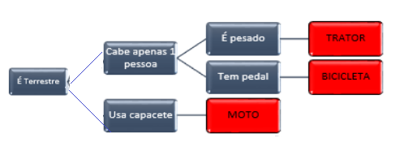

## Instruções

Levando em consideração os aprendizados sobre as estruturas condicionais, elabore um algoritmo que possa descobrir, através de perguntas e respostas, qual é o meio de transporte que o usuário está considerando. O usuário deverá escolher uma das seguintes opções:

- trator; 
- moto; 
- bicicleta. 

Para chegar ao resultado, as perguntas precisam ser respondidas apenas com "Sim" ou "Não".

Exemplo:
É terrestre? Sim.
Cabe apenas uma pessoa? Sim.
É pesado? Não.
Tem pedal? Sim.
Então, o transporte escolhido foi a bicicleta.

Para chegar ao resultado de cada uma das opções, use o modelo em anexo.

<p align="center">
  
</p>

## Resolução (Algoritmo feito em portugol)

```portugol
Algoritmo DescobrirTransporte
Var
    resposta: caractere

Inicio
    Escreva("==== Descubra o meio de transporte ====")
    
    Escreva("É terrestre?")
    Leia(resposta)
    Se resposta = "Sim" entao
        Escreva("Usa capacete?")
        Leia(resposta)
        Se resposta = "Sim" entao
            Escreva("O transporte escolhido foi a moto.")
        Senao
            Escreva("É pesado?")
            Leia(resposta)
            Se resposta = "Sim" entao
                Escreva("O transporte escolhido foi o trator.")
            Senao
                Escreva("O transporte escolhido foi a bicicleta.")
            FimSe
        FimSe
    Senao
        Escreva("O transporte escolhido não é terrestre.")
    FimSe

FimAlgoritmo
```
